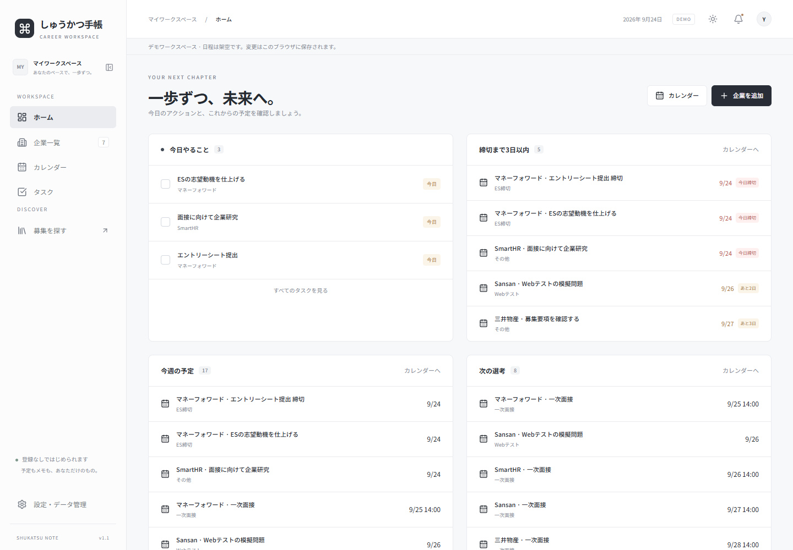
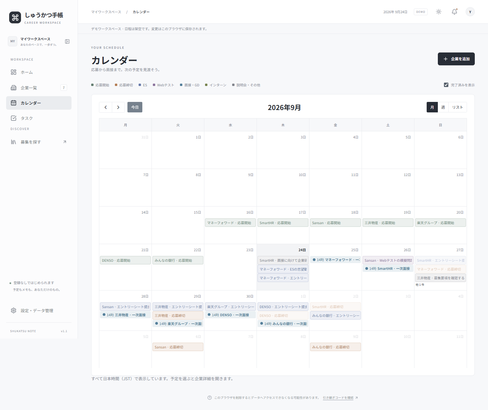
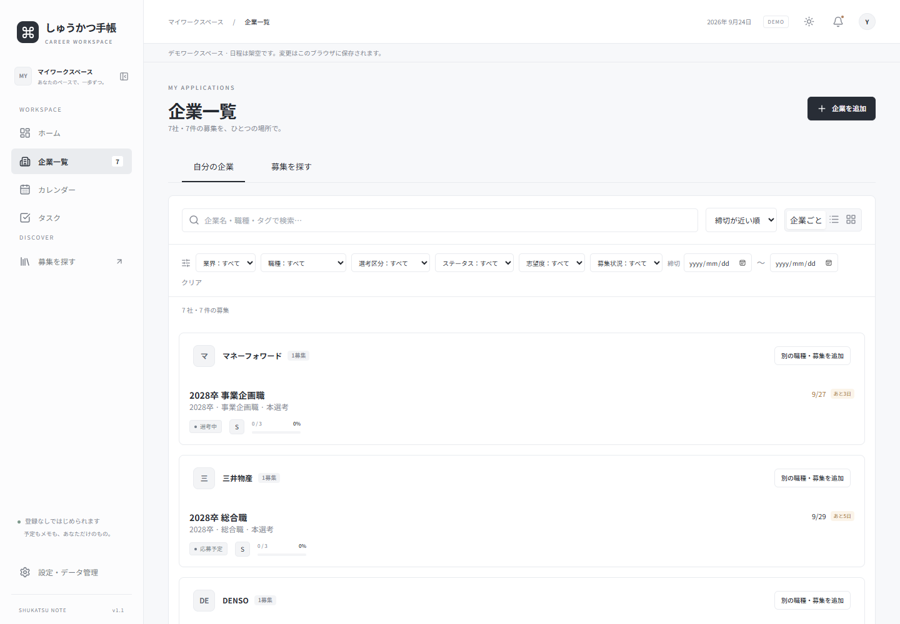
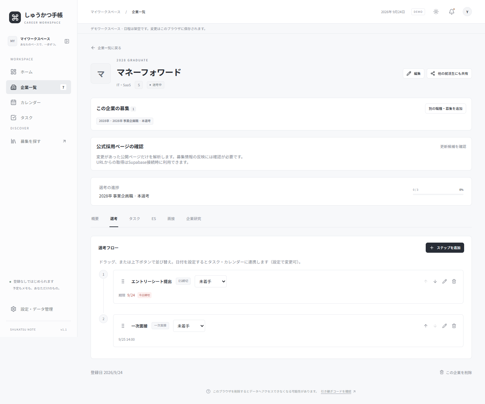
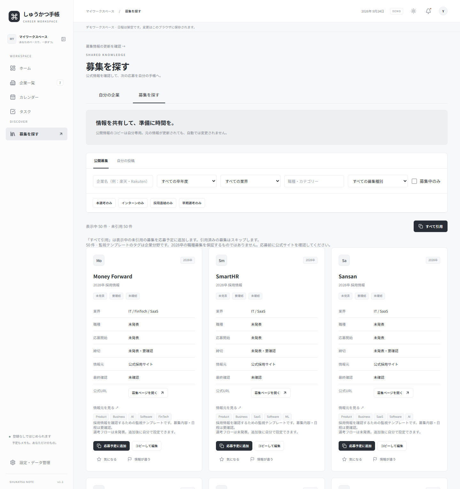
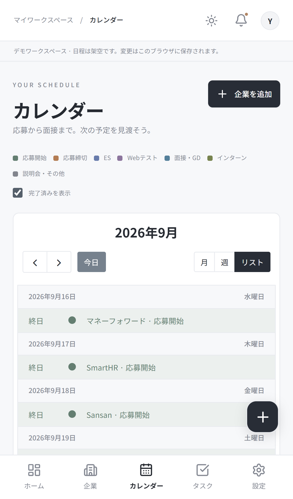
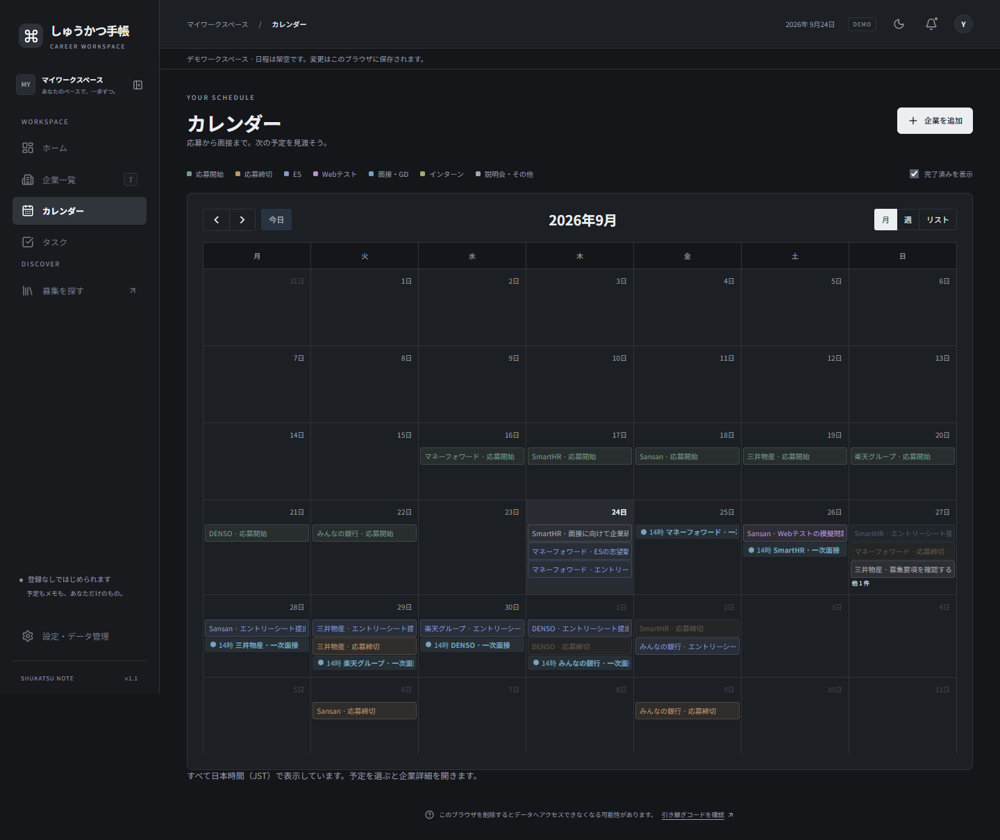
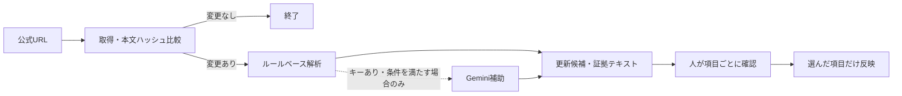

# しゅうかつ手帳

**CAREER WORKSPACE v1.1 — 今日の準備から、次の選考まで。**

企業・募集・締切・選考フロー・ES・面接をひとつの手帳に。登録・ログイン画面なしで使える、日本語の就活管理Webアプリです。2028卒に限らず、卒年度を指定して管理できます。

[アプリを開く](https://syukatu-note.vercel.app/) · [セットアップ](docs/setup.md) · [募集情報の自動取得](docs/recruitment-monitoring.md) · [設計・データ保護](docs/architecture.md)



> 画像はローカルのデモモードで撮影した実際のアプリ画面です。個人データは使用していません。企業に紐づく選考・日程は表示確認用の架空情報で、実際の募集日程を示すものではありません。

## できること

| やりたいこと         | 機能                                                                       |
| -------------------- | -------------------------------------------------------------------------- |
| 今週の行動を決める   | 今日のタスク、3日以内の締切、今週の予定、次の選考をホームに集約            |
| 応募先を整理する     | 企業ごとの募集グループ、複数職種の独立管理、検索・絞り込み・並び替え       |
| 締切を見落とさない   | 月／週／リストのカレンダー、定員に達し次第の締切、募集終了の記録           |
| 選考を進める         | 状態・結果・期限を持つ選考フロー、並び替え、タスク・カレンダー連携         |
| 募集を見つける       | 公開テンプレート検索、気になる企業の保存、引用・コピーして編集・すべて引用 |
| 情報の更新を確認する | 公式採用ページの取得、ルール解析、証拠付き差分、項目ごとの手動承認         |
| ES・面接を振り返る   | 複数ES設問、文字数カウンター、過去ES検索、面接の質問・回答・振り返り       |
| スマホで使う         | 下部ナビ、ライト／ダークモード、ホーム画面への追加（PWA）                  |
| データを持ち運ぶ     | 安全な引き継ぎコード、企業・選考・タスクのCSV入出力                        |

**公開されるのは募集情報だけです。** ES回答、面接記録、個人メモ、志望度、選考結果、個人タスクは共有しません。引用した募集は自分専用のコピーになり、元のテンプレートの更新で勝手に書き換わりません。

## 画面を見る

### 予定を見渡す

応募開始、締切、ES、Webテスト、面接をカレンダーへ集約。予定をクリックすると該当企業の詳細を開きます。日本時間（Asia/Tokyo）で表示します。



### 企業ごとに管理し、選考を進める

同じ会社の複数募集をまとめて表示しながら、応募状況やESは募集ごとに管理できます。選考フローはドラッグ操作と上下ボタンで並び替えられます。

| 企業一覧                                                   | 選考フロー                                                                    |
| ---------------------------------------------------------- | ----------------------------------------------------------------------------- |
|  |  |

### みんなの募集を、自分の手帳へ

企業名・業界・職種・卒年度・募集種別で検索し、応募予定へ追加できます。「すべて引用」は表示中の未引用募集をまとめて追加し、検索画面に留まります。



初期seedは50社の企業マスターと採用情報の監視用テンプレートです。未確認の日程は空欄、募集状況は「要確認」とし、募集が存在すると推測して登録しません。

<details>
<summary>スマートフォン・ダークモードの画面</summary>

<p>スマートフォンでは下部ナビから主要画面へ移動できます。</p>




</details>

## 最初の使い方

1. **募集を探す** — 公開テンプレートを検索し、「応募予定に追加」。手入力でも登録できます。
2. **自分の予定を入れる** — 志望度や選考フローを編集し、期限・実施日時を設定します。
3. **今日の行動を確認する** — ホームとカレンダーで予定を確認し、完了したタスクにチェックします。
4. **記録を残す** — ES、面接、企業研究を募集ごとに保存します。
5. **更新を確認する** — 公式ページから取得した候補を確認し、必要な項目だけ反映します。

ブラウザの保存データを削除すると、自分の記録にアクセスできなくなる可能性があります。設定画面で引き継ぎコードを発行し、別の安全な場所に保管してください。引き継ぎは所有権の移動であり、複数端末の同時同期ではありません。

## ローカルで試す（Supabase不要）

**Node.js 22以上・pnpm 11.19.0** を使用します。Node.jsをインストールした後はターミナルを開き直し、`node --version` で確認してください。

```bash
git clone https://github.com/AMZ-jpcslr/Syukatu-Note.git
cd Syukatu-Note
npm install -g pnpm@11.19.0
pnpm install --frozen-lockfile
```

`.env.example` を `.env.local` にコピーします。既に設定済みのファイルがある場合は上書きせず編集してください。

```bash
# macOS / Linux
cp .env.example .env.local
```

```powershell
# Windows PowerShell
Copy-Item .env.example .env.local
```

`.env.local` のデモ設定を変更して起動します。

```dotenv
NEXT_PUBLIC_DEMO_MODE=true
```

```bash
pnpm dev
```

[localhost:3000](http://localhost:3000) を開くと、7社のデモ企業と架空の日程が表示されます。編集内容はそのブラウザのlocalStorageに保存されます。デモでは他ブラウザとの共有、引き継ぎ、採用ページの自動取得は実行しません。本番設定が不足したときにデモへ自動切り替えすることもありません。

## Supabase・Vercelで運用する

1. Supabaseプロジェクトを作り、**Anonymous Sign-Ins** を有効にします。
2. [セットアップ手順](docs/setup.md)に沿って、未適用のmigrationを番号順に実行します。現在は **001〜005** です。
3. `supabase/seed.sql`、続いて `supabase/seed-recruitment-sources.sql` を実行します。初期50社と監視URLを追加します。
4. 下記の環境変数をVercelの対象環境へ登録します。
5. Framework PresetをNext.js、Install Commandを `pnpm install --frozen-lockfile`、Build Commandを `pnpm build` にしてデプロイします。
6. 別ブラウザとのデータ分離、企業登録と再訪、引用、カレンダー連携を確認します。

**既存DBでは適用済みmigrationを再実行しません。** 初期テーブルを作り直したり、本番で `supabase db reset` / `drizzle-kit push` を実行したりしないでください。SQL Editorで適用する場合は各ファイルを全文実行します。詳しい適用順・確認SQL・既存環境の更新手順は[セットアップ](docs/setup.md)にまとめています。

### 環境変数

| 変数                                   | 用途・設定                                                             |
| -------------------------------------- | ---------------------------------------------------------------------- |
| `NEXT_PUBLIC_SUPABASE_URL`             | 本番必須。Supabase Project URL                                         |
| `NEXT_PUBLIC_SUPABASE_PUBLISHABLE_KEY` | 本番必須。`sb_publishable_...` の公開キー                              |
| `NEXT_PUBLIC_DEMO_MODE`                | 本番は `false`。ローカルデモのみ `true`                                |
| `SUPABASE_SERVICE_ROLE_KEY`            | 自動取得機能を使う場合のサーバー専用キー。`SUPABASE_SECRET_KEY` でも可 |
| `CRON_SECRET`                          | Cron認証用のランダムな秘密値                                           |
| `RECRUITMENT_MONITOR_ENABLED`          | `true` でCron処理を有効化。既定OFF                                     |
| `GEMINI_API_KEY`                       | 任意。未設定でもルール解析・差分レビューは動作                         |
| `RECRUITMENT_AI_ENABLED`               | 任意のAI補助を許可する場合のみ `true`。既定OFF                         |
| `RECRUITMENT_GEMINI_MODEL`             | 任意。既定 `gemini-2.5-flash-lite`                                     |
| `RECRUITMENT_AI_MONTHLY_LIMIT`         | 任意。AI呼び出しの全体月間上限。既定50回                               |
| `DATABASE_URL`                         | Drizzle CLI／CLI seed用。通常のVercel実行には不要                      |

ひな形は [.env.example](.env.example) にあります。公開キーはSupabaseの **Settings → API Keys** から取得します。`sb_secret_...` や `service_role` は公開キー欄へ入力しないでください。`NEXT_PUBLIC_` の値はビルド時に組み込まれるため、変更後は新しいビルドが必要です。

「Supabase is not configured」「環境変数が未設定です」が出た場合は、[接続設定の切り分け](docs/setup.md#トラブルシューティング)を参照してください。SQLを再実行しても、環境変数の不足は解消しません。

## 公式採用ページの自動取得



**OpenAI APIは使用しません。Gemini API Keyも必須ではありません。** 自動処理は更新候補の作成までで、公開テンプレートや個人の応募情報を勝手に更新しません。締切不明は `null`、時刻不明は日付のみとし、前年の日程や23:59を補いません。

企業詳細の「最新情報を取得」、企業追加の「URLから登録」、`/templates/updates` の差分レビューを利用できます。日程のカレンダー追加・選考からのタスク生成も承認時に選べます。

[自動取得の設定・Cron・レビュー権限・robots.txt・コスト管理 →](docs/recruitment-monitoring.md)

## 技術構成・ディレクトリ

| 領域           | 使用技術                                                               |
| -------------- | ---------------------------------------------------------------------- |
| アプリ         | Next.js 16.3.5 / App Router / React 19 / TypeScript                    |
| UI             | Tailwind CSS 4 / shadcn/ui形式のコンポーネント / Radix Dialog / Lucide |
| データ         | Supabase PostgreSQL・Auth・PostgREST / RLS / Drizzleスキーマ           |
| フォーム・状態 | React Hook Form / Zod / TanStack Query                                 |
| 日程           | date-fns / FullCalendar 6.1.21 / Luxon                                 |
| 検証           | Vitest / PGlite / Playwright                                           |

```text
src/
  app/                 ページ・API・Cronルート
  components/          企業、カレンダー、選考、レビューなどのUI
  lib/                 型、日付、認証、データ操作
  services/            URL取得、ルール解析、任意AI、差分、キュー処理
  db/schema.ts         Drizzleの型付きスキーマ
supabase/
  migrations/          テーブル・RLS・RPCの正本（001〜005）
  diagnostics/         読み取り専用の設定確認SQL
  seed.sql             50社の公開テンプレート
  seed-recruitment-sources.sql
scripts/               seed、実ページ確認、README画像撮影
tests/                 単体・DB・E2Eテスト
docs/                  導入・運用・設計と画面画像
```

[匿名認証・共有と個人コピーの分離・DB構成 →](docs/architecture.md)

## 開発・検証

```bash
pnpm lint
pnpm test
pnpm build
pnpm test:e2e
```

`npm run lint` / `npm run test` / `npm run build` でも同じscriptsを実行できます。依存関係のインストールは同梱の `pnpm-lock.yaml` を使ってください。

単体・DBテストは実Supabaseへの接続なしで動作します。PGliteにmigrationを適用してRLS・RPC・コピー独立性・部分承認などを検証します。E2Eはポート3100のデモでデスクトップとスマホ幅を確認します。Supabase Authや本番Cronの動作はデプロイ後に別途確認してください。

E2Eの既定ブラウザはEdgeです。Chromiumを使う場合の設定やREADME画像の撮り直し手順は、[開発・撮影手順](docs/development.md)を参照してください。

## 現在の制約

- **CSVは完全バックアップではありません。** 対象は企業・募集・選考・タスクです。ES・面接・企業研究を含む移行は引き継ぎコードを使います。
- PWAはホーム画面への追加とオフライン案内に対応します。オフライン編集・同期キュー・バックグラウンドPush通知は未実装です。
- 自動取得は公開HTMLが対象です。ログイン、CAPTCHA、JavaScript必須のMyPage、PDF・画像からの読み取りは行いません。
- 自動抽出はページ構造に依存します。未取得・年度不明・複数候補は人の確認が必要で、募集内容の正確性を保証しません。
- 選考ステップと面接記録の両方に同じ面接日時を設定すると、カレンダーにも両方表示されます。

詳細は[運用上の制約](docs/recruitment-monitoring.md#取得制限と運用上の制約)と[データ保護](docs/architecture.md#匿名利用とデータ保護)を確認してください。
