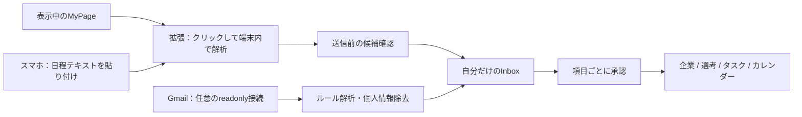

# v2 — MyPage・メールから、自分の手帳へ

[README](../README.md) · [Supabase / Vercel設定](setup.md)

v2では、表示中のMyPageや採用メールの日程を解析し、**非公開の「自動取得」Inboxで承認してから**企業・選考・タスク・カレンダーへ反映します。匿名ユーザーIDと公開テンプレートは従来の仕組みを維持します。



## まずWebアプリを更新する

1. 既存DBのバックアップを確保します。001〜005適用済みなら、[006 v2_import.sql](../supabase/migrations/202609240006_v2_import.sql) **だけを全文、一度実行**します。新規DBは001〜006を順に適用します。
2. 既存のSupabase公開URL・公開キー・匿名サインイン設定を維持します。サーバー用 `SUPABASE_SERVICE_ROLE_KEY`（または既存の `SUPABASE_SECRET_KEY`）が必要です。
3. Vercelに `APP_URL=https://syukatu-note.vercel.app` を設定します。独自ドメインなら、その実際のオリジンを指定します。
4. Webをデプロイします。`/inbox` のテキスト取り込みと `/planner` はChrome拡張・Gmail・Geminiなしで使えます。
5. 拡張を使う場合は、下記のID登録とペアリングを行います。

006はテーブル・列・RLS・RPCを追加し、既存レコードや匿名ユーザーIDを削除しません。既存の日付は由来を断定できないため、利用者が管理する日付として保護します。50社のseedの再実行は不要です。`db reset` は使用しません。

確認用：[check_v2.sql](../supabase/diagnostics/check_v2.sql)。SQL Editorで適用した場合、Supabase CLIのmigration履歴は別管理です。履歴を照合せず `db push` を実行しないでください。

## Chrome拡張をインストールする

Node.js 22以上で、リポジトリのルートから実行します。依存関係はpnpmのロックファイルを使用します。

```bash
pnpm install --frozen-lockfile
npm run build:extension
```

1. Chromeで `chrome://extensions` を開き、「デベロッパーモード」をONにします。
2. 「パッケージ化されていない拡張機能を読み込む」から **`packages/browser-extension/dist`** を選びます。
3. 表示された拡張ID（32文字）をコピーします。
4. Vercelの `EXTENSION_ORIGINS` に `chrome-extension://ここに拡張ID` を設定し、再デプロイします。複数IDはカンマ区切りです。ワイルドカードは使用しません。
5. Webアプリの **設定 → 拡張・Gmailの接続 → ペアリングコードを発行** を選びます。
6. 拡張を開き、プライバシーの案内を確認して、そのコードを入力します。

コードは10分で失効し、一度だけ使用できます。内部のユーザーUUIDではありません。発行されるデバイストークンは取り込み専用・90日有効で、DBにはハッシュのみ保存します。Webの設定からデバイスごとに失効できます。引き継ぎコードで別ブラウザへ移行した場合は、拡張を再ペアリングしてください。

ビルド済みファイルはGit管理対象外です。更新時は再ビルドし、拡張管理画面の再読み込みボタンを押します。読み込むフォルダーを変更するとIDが変わる場合があるため、許可オリジンも確認してください。

### 拡張の使い方

1. **自分で通常どおりログインしたMyPage** を開きます。
2. 拡張アイコン → 「このページから就活情報を取り込む」を押します。
3. 企業・卒年度・締切・証拠テキストを確認し、「しゅうかつ手帳に送る」を押します。
4. Webの **自動取得** で、新規企業か既存の選考を選択します。
5. 企業・募集・選考フロー・各日程をチェックし、タスクとカレンダーへの追加を選んで「確認して反映」を押します。

テキストを選択して右クリック → 「しゅうかつ手帳に追加」も使えます。右クリックだけではサーバーへ送信されません。拡張内の候補を確認して送信します。

バッジの件数は利用者が端末内解析を行った後に表示します。常時全サイトを監視する権限は要求しません。これは閲覧中ページだけの一時アクセスを許可する [Chrome activeTab](https://developer.chrome.com/docs/extensions/develop/concepts/activeTab) を使う設計です。

### 開発中の接続先

ターミナルを2つ使います。

```bash
# Web（.env.local の APP_URL=http://localhost:3000）
npm run dev

# Extension：監視ビルド、接続先 localhost:3000
npm run dev:extension
```

ローカルで発行された拡張IDも `.env.local` の `EXTENSION_ORIGINS` に登録し、Webを再起動します。`NEXT_PUBLIC_DEMO_MODE=true` では端末内のテキスト取り込み・レビューを試せますが、拡張のペアリング・Gmailは実Supabase接続が必要です。

本番接続先を変更してビルドする場合（PowerShell）：

```powershell
$env:EXTENSION_APP_URL='https://YOUR_APP.example'
npm run build:extension
```

MV3・TypeScript・React・Chrome Storage APIを使用し、esbuildで同梱します。Webと日付・辞書・サニタイザーを共有するため、WXT / Plasmoは追加していません。Chrome Web Storeへのアップロード自体は未実施です。公開時は `dist` の内容をZIP化し、ストアの説明・スクリーンショット・連絡先・公開プライバシーポリシーURL・データ利用申告を準備してください。

## 何を解析し、何を保存するか

- 対応アダプター：SNAR / i-web / HRMOS / 採用プラットフォーム / 汎用ページ。
- `main` / `article` の表示本文、見出し、表、リストから日程を抽出します。入力欄、編集領域、非表示要素、スクリプト、Cookieバナー、回答・プロフィール欄を除外します。
- パスワード、Cookie、ログイン操作、認証トークンを扱うChrome権限はありません。フォーム値・ES回答は取り込み対象外です。
- URLのquery・fragment・トークンを含む経路を除去し、連絡先などをマスクします。送信前とAPI側の両方で、許可した抽出フィールドだけに絞ります。
- DBに保存するのは、抽出結果・短い証拠・サニタイズしたURL/タイトル・ハッシュです。DOMやページ本文の全文は保存しません。
- 独自のページ構造では抽出できない場合があります。プレビューで送信内容を必ず確認し、不要な内容が見えた場合は送信せず、日程部分だけを選択して取り込んでください。
- サーバーがMyPageへログインすることはありません。従来のURL解析は公開ページ専用です。

### 日付・選考フローの扱い

`2026/9/28(月) 23:59 JST` は `2026-09-28T23:59:00+09:00`、正午は12:00、午後2時は14:00です。時刻がなければ日付のみです。23:59を補完しません。

i-web例の `10/3・10/17・10/31` だけなら**3つの候補**を作りますが、年はnullにします。`2028卒` は開催年の根拠にしません。日程が未確定の候補はカレンダーへ追加せず、明確な開催年を含むお知らせで再取り込みします。複数卒年度が混在する本文は、対象年度の部分に絞って取り込み直します。

選考フローは、明示された見出し・矢印の順序を使用します。一般的な採用手順を勝手に追加しません。

## Inbox・差分・重複・手動修正

`/inbox` は本人だけが読めるInboxです。MyPage → Mail → Official → Sharedの順に扱い、従来の公式サイト候補もここから既存レビューへ移動できます。

同じ取得元・同じ抽出内容は重複保存しません。再取り込みで変化した日程は前回値と比較します。承認済みの日程・タスクは、同じ募集・種別・日程で重複を防ぎます。同じ取得元で日程が変わった場合は既存の取り込み予定を更新します。複数職種は反映先のApplicationを分けて選択してください。

出典・証拠・更新日時・手動修正の有無を保持します。手動修正済みの値、または優先順位が高い出典の値を置き換える場合は、追加の上書きチェックが必要です。公開テンプレートや他ユーザーの選考データは変更しません。承認履歴は `import_audit` に記録します。

CSVは、従来の企業・選考・タスクに加え、取り込み予定・正確なタスク時刻・所要時間・カレンダー表示設定を保持します。分割CSVでは取り込み予定は `applications.csv` 内の `imported_events` JSON列に格納します。Inbox・認証情報・ES・面接の完全バックアップではありません。

## Gmail連携（任意）

Google設定がなくても、Web・拡張の主要機能は使えます。Gmailは独立したOAuth接続で、アプリの匿名ユーザーIDを変更しません。

1. Google CloudプロジェクトでGmail APIを有効にします。
2. OAuth同意画面とWebアプリ用OAuthクライアントを作ります。
3. リダイレクトURIに `https://YOUR_APP/api/gmail/callback` を登録します。ローカルは `http://localhost:3000/api/gmail/callback` を別途登録します。
4. `GOOGLE_CLIENT_ID`、`GOOGLE_CLIENT_SECRET`、`GMAIL_TOKEN_ENCRYPTION_KEY` をサーバー環境変数に設定します。
5. Webの設定でGmailを接続し、「採用メールの自動解析」をONにします。接続直後はOFFです。

暗号化キーは32バイトの乱数をbase64にします。これは `CRON_SECRET` やSupabaseキーとは別です。

```bash
node -e "console.log(require('node:crypto').randomBytes(32).toString('base64'))"
```

```powershell
# Node.jsがない場合
$gmailKeyBytes = New-Object byte[] 32
$gmailRandom = [System.Security.Cryptography.RandomNumberGenerator]::Create()
$gmailRandom.GetBytes($gmailKeyBytes)
[Convert]::ToBase64String($gmailKeyBytes)
$gmailRandom.Dispose()
```

スコープは `https://www.googleapis.com/auth/gmail.readonly` のみで、送信権限は要求しません。OAuth stateは一回限り・10分有効でブラウザのHttpOnly Cookieと照合します。refresh tokenはAES-256-GCMで暗号化し、サーバー専用テーブルへ保存します。暗号化キー変更後は再接続が必要です。

過去7日、採用関連キーワードに一致するメールを1回最大30件取得します。本文は処理中のメモリ内だけで使い、message ID・受信日時・サニタイズした件名・候補・短い証拠のみ保存します。添付ファイルは解析しません。日時の年が本文から分からない場合、受信年で推測しません。同期処理は候補作成までで、自動承認しません。

`vercel.json` の `/api/cron/gmail` は毎日00:45 UTC（09:45 JST）に起動します。`CRON_SECRET` で認証し、ONのユーザーを最終同期が古い順に最大3人、順番に処理します。大量の接続や30件超のメールは次回へ繰り越します。即時性が必要なときは設定画面の手動同期を使えます。利用するVercelプランのCron・実行時間制限も確認してください。

Googleの `gmail.readonly` は [restricted scope](https://developers.google.com/workspace/gmail/api/auth/scopes) です。外部公開にはOAuth審査やセキュリティ評価が必要になる場合があります。テスト時は同意画面にテストユーザーを登録し、トークン失効時は再接続してください。[Google OAuthの公式手順](https://developers.google.com/identity/protocols/oauth2/web-server)も参照してください。

設定の「解除」で保存済み認証情報を削除し、Googleへの失効要求も行います。既に承認した自分の予定は残ります。端末引き継ぎ後はGmailを再接続します。

## Today Planner・経験タグ

`/planner` に使える時間を入力すると、未完了タスクを期限・志望度・選考状況から順位付けし、時間内に収まるものを提示します。

- 締切1日以内 +100 / 3日以内 +60 / 7日以内 +30
- S志望 +40 / A志望 +20 / 選考中 +20 / 未完了 +15
- 同点では短い所要時間を優先。終えたタスクは除外します。

所要時間は編集できます。取り込みタスクの既定値はES・Webテスト・面接60分、応募15分、イベント予約10分です。

設定にスキル・経験・関心タグを保存すると、企業詳細の「自分との関連を見る」で求人タグとの共通項目を表示します。採用確率や合否を予測する機能ではありません。プロフィールは非公開です。

## Gemini補助（任意）

`GEMINI_API_KEY` と `RECRUITMENT_AI_ENABLED=true` を設定した場合のみ、テキスト取り込みプレビューの任意ボタンから利用できます。未設定・API失敗・月間予算超過ではルール結果を維持します。OpenAI APIは使用しません。

送信するのは、画面に出ているサニタイズ済み候補と短い証拠だけです。ページ・メールの全文、匿名ID、ES、面接メモ、プロフィール、引き継ぎコードは送りません。新しい日時は証拠に含まれるかを検証し、卒年度や選考順序を勝手に変えた結果は採用しません。Gmailの自動同期でGeminiを呼ぶことはありません。Today Plannerはルールのみで動作します。

## セキュリティと検証

- ペアリングコード/トークンは乱数で生成し、サーバーにはSHA-256ハッシュだけ保存。
- 拡張IDのCORS許可リスト、Origin照合、Bearer認証、JSONサイズ制限、DBでの原子的なレート制限。
- Webの変更APIもOriginと既存Supabase JWTを検証。GmailはOAuth stateとブラウザnonceを照合。
- privateテーブルのRLSは `auth.uid()` に一致する本人だけを許可。所有者の複合外部キーで他ユーザーのApplicationへの関連付けを防止。
- 承認RPCは一つのトランザクションで実行し、再承認・他人の候補の承認を拒否。
- 取り込み先サーバー以外への通信権限やリモート実行コードを拡張へ追加しません。

```bash
npm run lint
npm run test
npm run build
npm run build:extension
```

WindowsでE2Eも実行する場合：

```powershell
$env:EXTENSION_TEST_CHANNEL='msedge'
npm run test:e2e
```

Chromiumを使う場合はPlaywrightのChromiumを用意し、`EXTENSION_TEST_CHANNEL=chromium` を指定します。Web側のブラウザ設定は [開発手順](development.md) を参照してください。

テストは提供されたMIXI/SNAR・i-web例文を使用します。ビルド済みMV3拡張の起動・DOM除外・抽出・送信はEdgeで検証し、送信APIはテスト内で差し替えます。WebのInbox→承認→タスク/カレンダーと、DBのRLS/承認RPCは別の統合テストで検証します。実際のログイン済みMIXIアカウント、Google OAuth、本番Supabase/Vercelへの反映は開発環境のテストに含まれません。

導入後は本人のMyPageで、抽出の証拠・日時・非公開性・承認後のタスク/カレンダーを確認してください。OCR、全ページの常時自動検出、Chrome Web Store公開はこの実装には含まれません。

### この変更での検証結果（2026-09-24）

- `npm run lint`：成功
- `npm run test`：120件成功（12ファイル）
- `npm run build`：成功（Next.js 16.3.5）
- `npm run build:extension` 相当のビルドスクリプト：成功
- Playwright：17件成功、スマホ対象外の拡張起動1件はskip。表示修正後の取り込み関連テストもPC・スマホで再確認。
- 既存レコードを持つDBへの001→006移行、匿名ID維持、他人のInbox/予定の非公開性、部分承認、変更日の重複防止、手動修正保護、CSV復元をPGliteで確認。

本番DBへのSQL適用、Vercelデプロイ、Google OAuthの外部公開審査、Chrome Web Store公開は実行していません。
